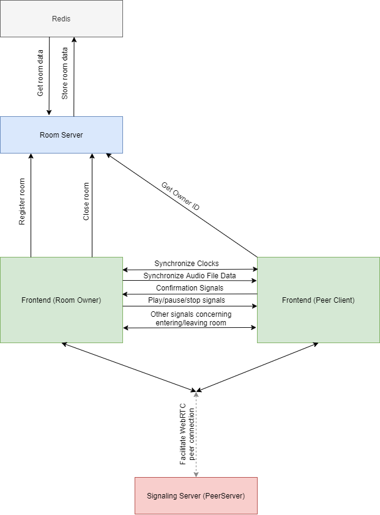

# SyncTune Documentation 

Welcome to the SyncTune documentation site!

Synctune is a web application that uses WebRTC to allow for music synchronization between multiple devices, essentially creating one big speaker.

## Application Structure

